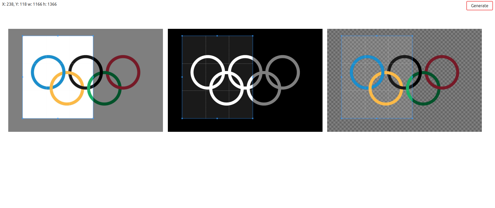

# Image augmentation with manual cropping

Easily generate multiple dataset with this parallel cropping tool.

## Installation

`pip install -r requirements.txt`

## Running server

`python manage.py runserver`

